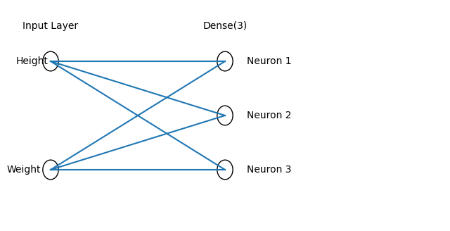

# 3. AI 모델링
- [머신러닝 모델 학습](#머신러닝-모델학습)
- [딥러닝 모델 학습](#딥러닝-모델-학습)
- [모델 성능 평가 및 시뮬레이션](#모델-성능-평가-및-시뮬레이션)
- [모델 성능 개선 및 그래픽 출력](#모델-성능-개선-및-그래픽-출력)

### 머신러닝 모델학습


|구분|지도학습|비지도학습|
|-|-|-|
|정답|O|X|
|목적|결과값 예측 및 분류 | 데이터 내 구조 및 패턴 발견 |
|유형| - 회귀: 연속적인 숫자 (주가 예측, 기온 예측)  <br> - 분류 : 범주형(Yes/No, A/B/C) (스팸 차단, 동물 맞축) | - 군집화 : 유사성 데이터 그룹화하기 (고객 세분화) <br> - 차원축소 : 핵심적인 특징만 남겨 데이터 압축 (고해상도 이미지 압축)|
|주요 알고리즘|선형 회귀, 의사결정나무, KNN|K-Means, PCA|

<br>

- 선형 회귀

```Python
from sklearn.linear_model import LinearRegression

# 모델 생성 및 학습
model = LinearRegression()
model.fit(X_train, y_train)

# 데이터 예측
pred = model.predict(X_valid)
```

- 로지스틱 회귀
```Python
from sklearn.linear_model import LogisticRegression

# 모델 생성 및 학습
model = LogisticRegression()
model.fit(X_train, y_train)

# 데이터 예측
pred = model.predict_proba(X_valid) # 확률 확인 
result = model.predic(X_valid) # 최종 예측 결과
```
- 의사결정나무(분류)
```Python
from sklearn.tree import DecisionTreeClassifier

# 모델 생성 및 학습
model = DecisionTreeClassifier(max_depth=3) # 과적합방지를 위한 최대 깊이 3 제한
model.fit(X_train, y_train)

# 데이터 예측
pred = model.predict(X_valid)
```


### 딥러닝 모델 학습
- 입력층/은닉층/출력층으로 구성

#### 라이브러리
```python
# 라이브러리
from tensorflow.keras.models import Sequential
from tensorflow.keras.layers import LSTM, Dense, Conv2D
```
- Sequential : 레이어를 쌓기 위한 틀
- Dense : 모든 노드를 이어주는 레이어 층

- LSTM : 시계열 데이터
- Conv2D : 이미지 데이터

```python
# 1. 모델 설계(ANN)
model = Sequential([
    # 입력층에 이미지인 경우, Conv2D 시계열인 경우, LSTM을 사용
    Dense(64, activation='relu', input_shape=(10,)),
    Droupout(0.3), # 30% 뉴런을 랜덤으로 끊어 과적합 방지
    Dense(32),
    Dense(1)
])

# 2. 컴파일
model.compile(optimizer='adam', loss='binary_crossentropy', metrics='accuracy'])

# 3. 학습
history = model.fit(X_train, y_train, epochs=5, batch_size=32, verbose=1)
```

### 모델 성능 평가 및 시뮬레이션
- 회귀 : MSE, RMSE, R2
- 분류 : Accuracy, Recall, F1-Score

``` Python
from sklearn.metrics import mean_squared_error, r2_score
from sklearn.metrics import accuracy_score, classification_report, confusion_matrix

# y_test는 테스트 데이터 정답, y_pred는 모델로 예측한 값
# 1. 회귀모델 평가
mse = mean_squared_error(y_test, y_pred)
r2 = r2_score(y_test, y_pred)

# 2. 분류모델 평가
accuracy = accuracy_score(y_test, y_pred)
 # 정밀도, 재현율, F1-score을 한번에 보여주는 리포트
classification_report(y_test, y_pred, target_names=['Normal', 'Spam'])
```

### 모델 성능 개선 및 그래픽 출력